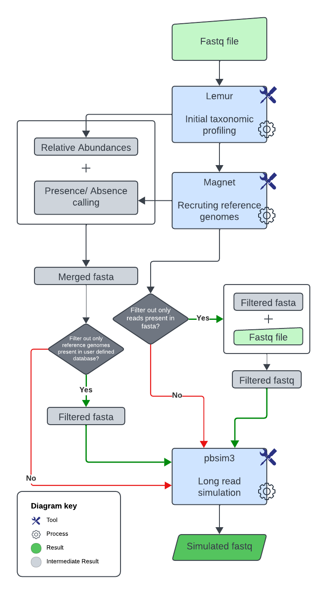

# MIMIC Metagenome Simulator

MIMIC creates simulated metagenomic read sets that mimic the taxonomic composition of an existing long-read sequencing sample[^1]. The current pipeline takes FASTQ input, profiles it with Lemur, refines reference-genome selection with MAGnet[^2], optionally filters the selected genomes and reads against a user database, and simulates reads with PBSIM3[^3].

This project was initially conceptualized and built during the Baylor College of Medicine Human Genome Sequencing Center (HGSC) 2024 Hackathon, and has been modified since then.


## Contents

- [Workflow](#workflow)
- [Repository layout](#repository-layout)
- [Installation](#installation)
- [Required inputs](#required-inputs)
- [Usage](#usage)
- [PBSIM models](#pbsim-models)
- [Outputs](#outputs)
- [Notes](#notes)
- [Contributors](#contributors)
- [References](#references)

## Workflow



MIMIC runs the following steps from `mimic.py`:

1. Checks that the provided output directory does not already exist. 
2. Creates a new output directory with `lemur/`, `magnet/`, `filter/`, `pbsim/`, and `simulated_data/` subdirectories.
3. If paired-end reads are supplied with `-I/--fastq2`, merges them with `pear` and uses the assembled FASTQ for downstream steps.
4. Runs Lemur against the user-provided Lemur database and writes `lemur/relative_abundance.tsv`[^2].
5. Runs MAGnet on the Lemur abundance report to select and download representative reference genomes[^2].
6. Optionally filters the MAGnet references and input reads with `--filter --filter-db`.
7. Runs PBSIM3 using the selected genomes and the requested simulation method[^3].
8. Concatenates PBSIM `*.fq.gz` files into `simulated_data/simulated.fastq`.

## Repository layout

```text
mimic.py          Main MIMIC entry point
mimic_env.yml            Conda environment file
src/                     Pipeline helper modules
magnet/                  Bundled MAGnet reference-selection workflow
pbsim/                   Bundled PBSIM model files
docs/img/                Workflow and logo images
```

## Installation

Clone the repository and create the conda environment from `mimic_env.yml`:

```bash
git clone https://github.com/collaborativebioinformatics/Mimic.git
cd Mimic
conda env create -f mimic_env.yml
conda activate mimic_env
```

The environment file includes the main command-line dependencies used by the current pipeline, including Python 3.9, Lemur, PBSIM3[^3], PEAR, minimap2, samtools, NCBI Datasets CLI, pandas, Biopython, and pysam.

To ensure that NCBI Datasets CLI is up-to-date and running smoothly, run the following commands after activating the conda environment before running MIMIC:
```bash
conda update ncbi-datasets-cli
conda update fastani
conda install conda-forge::gsl
```

## Required inputs

MIMIC requires:

- `-i/--fastq`: input FASTQ file.
- `-o/--output`: output directory. This directory must not already exist.
- `--db`: Lemur database directory. The pipeline expects this directory to include `taxonomy.tsv`.
- `--method`: PBSIM3 simulation method. Use `sample`, `errhmm`, or `qshmm`.

Optional paired-end input can be provided with `-I/--fastq2`. When this is used, MIMIC runs `pear` first and continues with the assembled FASTQ.

## Usage

Basic sample-profile simulation:

```bash
python mimic.py \
  -i input.fastq \
  -o mimic_output \
  --db /path/to/lemur_db \
  --method sample \
  -t 8
```

Simulation with an error HMM model:

```bash
python mimic.py \
  -i input.fastq \
  -o mimic_output_errhmm \
  --db /path/to/lemur_db \
  --method errhmm \
  --model ERRHMM-ONT-HQ \
  --depth 20 \
  --length-mean 9000 \
  --accuracy-mean 0.85 \
  -t 8
```

Simulation with optional filtering:

```bash
python mimic.py \
  -i input.fastq \
  -o mimic_output_filtered \
  --db /path/to/lemur_db \
  --method sample \
  --filter \
  --filter-db /path/to/filter_db.tsv \
  -t 8
```

The filter database is read as a tab-delimited file and should contain a `taxid` column. If present, an `assembly_accession` column is also recognized by the filtering helper.

### Command-line options

```text
-i, --fastq              Path to first FASTQ file. Required.
-I, --fastq2             Path to second FASTQ file for paired-end reads.
-o, --output             Path to a new output directory. Required.
--db                     Lemur database location. Required.
-t, --threads            Number of threads. Default: 1.
--depth                  PBSIM depth of coverage.
--length-min             PBSIM minimum read length.
--length-max             PBSIM maximum read length.
--sample-profile-id      PBSIM sample profile ID.
--accuracy-min           PBSIM minimum accuracy.
--accuracy-max           PBSIM maximum accuracy.
--difference-ratio       PBSIM substitution:insertion:deletion error ratio.
--bias                   PBSIM homopolymer deletion bias.
--filter                 Limit simulation to references found in --filter-db.
--filter-db              Filter database path. Required when --filter is set.
--method                 PBSIM method: sample, errhmm, or qshmm. Required.
--model                  PBSIM model name. Required unless --method sample.
--length-mean            PBSIM mean read length (not applicable if using --method sample).
--accuracy-mean          PBSIM mean read accuracy (not applicable if using --method sample).
```

## PBSIM models

Bundled PBSIM3 model files are stored in `pbsim/`[^3]. Pass the model name without the `.model` suffix:

```text
ERRHMM-ONT-HQ
ERRHMM-RSII
ERRHMM-SEQUEL
QSHMM-ONT
QSHMM-ONT-HQ
QSHMM-RSII
```

For example, `--method qshmm --model QSHMM-ONT-HQ` uses `pbsim/QSHMM-ONT-HQ.model`.

Run the following command inside the conda environment for detailed pbsim usage:
```bash
pbsim
```

## Outputs

Assuming `-o mimic_output`, important outputs include:

```text
mimic_output/lemur/relative_abundance.tsv
    Lemur species-level relative abundance table.

mimic_output/magnet/cluster_representative.csv
    MAGnet reference-genome selection, coverage, ANI, and presence/absence calls.

mimic_output/magnet/reference_metadata.csv
    Metadata for reference genomes considered by MAGnet.

mimic_output/magnet/reference_genomes/
    Reference FASTA files downloaded and prepared by MAGnet.

mimic_output/magnet/reference_genomes/merged.fasta
    MAGnet merged reference FASTA used by sample-profile PBSIM runs unless filtering is enabled.

mimic_output/magnet/sample.fasta
    FASTA built from present MAGnet references for non-sample PBSIM methods.

mimic_output/filter/filtered_fasta.fasta
    Filtered reference FASTA, created only when --filter is used.

mimic_output/filter/filtered.fastq
    Filtered input reads, created only when --filter is used.

mimic_output/filter/filter_log.txt
    Summary of filtering decisions, created only when --filter is used.

mimic_output/pbsim/
    Raw PBSIM outputs, including per-reference compressed FASTQ chunks.

mimic_output/pbsim_run_log.txt
    PBSIM command output and run log.

mimic_output/simulated_data/simulated.fastq
    Final concatenated simulated FASTQ file.
```

## Notes

- Run MIMIC from the repository root so `magnet/magnet.py` and the bundled `pbsim/*.model` files resolve correctly.
- The output directory must be new. MIMIC exits if the requested output directory already exists.
- For `errhmm` and `qshmm` methods, `--model` is required.
- For `sample` method, PBSIM uses the input reads as the sample profile through `--sample`.

## Contributors

Todd Treangen, Shwetha Kumar, Ryan Doughty, Sumaiya Khan, Iva Kotaskova, Arthur Shem Kasambula, Mike Nute, Eddy Huang, and Yin Min Thant.

## References

[^1]: Agustinho, Daniel P., Yilei Fu, Vipin K. Menon, Ginger A. Metcalf, Todd J. Treangen, and Fritz J. Sedlazeck. "Unveiling microbial diversity: harnessing long-read sequencing technology." Nature Methods (2024): 1-13.

[^2]: Sapoval, Nicolae, Yunxi Liu, Kristen Curry, Bryce Kille, Wenyu Huang, Natalie Kokroko, Michael G. Nute et al. "Lightweight taxonomic profiling of long-read sequenced metagenomes with Lemur and Magnet." bioRxiv (2024): 2024-06.

[^3]: Ono, Yukiteru, Kiyoshi Asai, and Michiaki Hamada. "PBSIM3: a simulator for all types of PacBio and ONT long reads." NAR Genomics and Bioinformatics 4, no. 4 (2022): lqac092.
